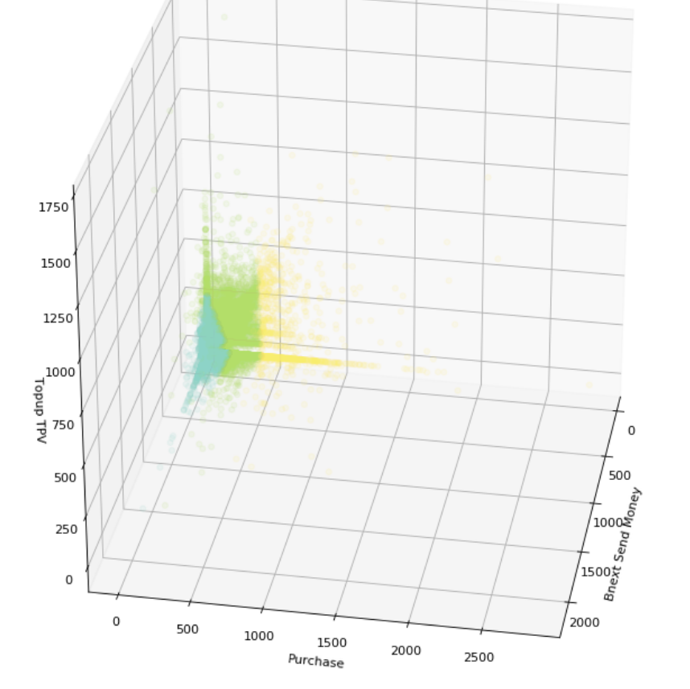
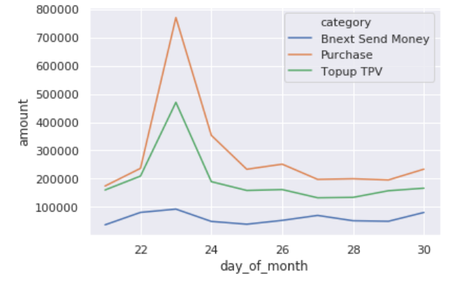
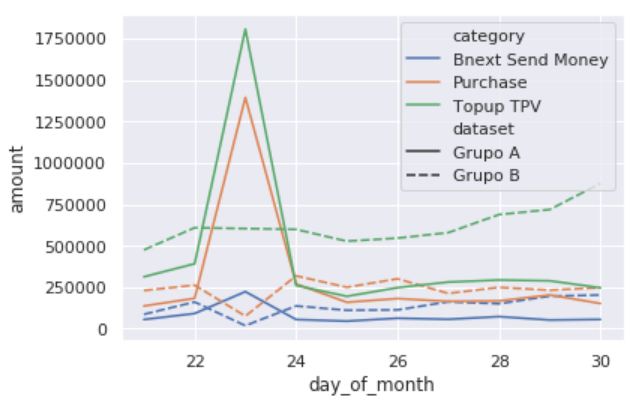

# Fintech-technical-test

Resumen de las conclusiones obtenidas. El documento **main.ipynb** contiene el desarrolo de la resolución de la prueba. 

## PREGUNTA 1:

**La primera pregunta tiene que ver con los usuarios que han gastado en este periodo. ¿Se te ocurre alguna manera de agrupar a los usuarios en función de su valor? Explica por favor la razón de agruparlos de la manera elegida y los cálculos que has realizado para ello.**

1. Aproximación clásica

Los agrupo en función de si gastan más de lo que ingresan ya que Bnex puede usar esta información para ofrecer préstamos.

Para ello agrupo cada una de las operaciones por usuario y calculo el total. Si gasta más de lo que ingresa se pone balance_pos en **False**, o **True** si el balance sale positivo.

SOLUCIÓN: Agrupamos los usuarios en función de su balance en el periodo de tiempo. Si es positivo o negativo para ofrecerles diferentes productos. 

2. Aproximación mediante Machine Learning

Otra forma de clasificar es mediante algún algoritmo de Machine Learning no supervisado En este caso he decidido usar **Kmeans**. De entre las opciones que he probado con la variable n_clusters, he decidido elegir n_clusters=3 ya que la diferenciación es más clara que con las demás.

Otros algoritmos posibles hubieran sido KNN y LDA (Latent Discriminant Analysis)

SOLUCIÓN: Se han categorizado los usuarios en función del uso de la aplicación que tienen.

## PREGUNTA 2:

**Te pregunta el CEO que no entiende la evolución de los datos en el periodo escogido, que le parece algo anómala. ¿Encuentras algún patrón que permita encontrar outliers? Esta es una pregunta abierta, puedes analizar los datos de la manera que quieras.**

El pico del 23 de Noviembre es el Black Friday.

No ocurren compras más grandes sino que más compras de las mismas cantidades. Prefiamente hemos eliminado outliers y filtrar el dataset para evitar días incompletos. 

Estudiando según la media entre los últimos 10 días del mes no hay una diferencia apreciable.

## PREGUNTA 3 (opcional):

**Busca el concepto de cohorte si no estás familiarizadx con él, y realiza un análisis de cohortes diarias. Puedes considerar que la primera transacción de cada usuario en la muestra fue su primera transacción en Bnext.**

Analizaremos dos grupos de entre los que han consumido durante el Black Friday. 
* el grupo A han gastado más de la media diaria (excluyendo el día en cuestión) en el black friday 
* el grupo B será el resto de usuarios

Se puede observar que el grupo B, el que no gastó más de la media en el Black Friday, tiende a ingresar en al aplicación más dinero que el otro grupo, que ingresa y gasta el mismo día 23. 